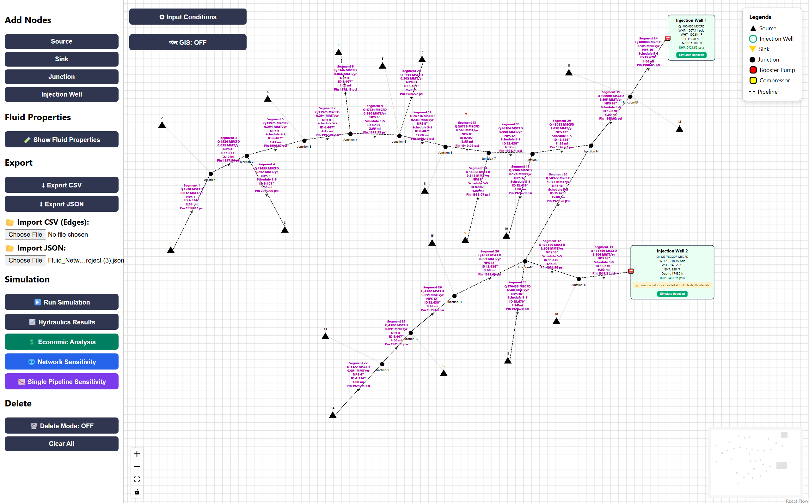

  
  <h2> Hao Duong   ✨ Petroleum Engineering ✨</h2>

  

## 📫 Let's Connect [My LinkedIn](https://www.linkedin.com/in/hao-duong-546970295/) 

  

## 🛠️ Tool & Language

  

## 🚀 Ongoing Project: CO₂ Pipeline Network Simulator

  

  A physics-based simulatior for CO₂ transportation & injection networks, 
  integrating hydraulics, thermodynamics, and economic analysis.

